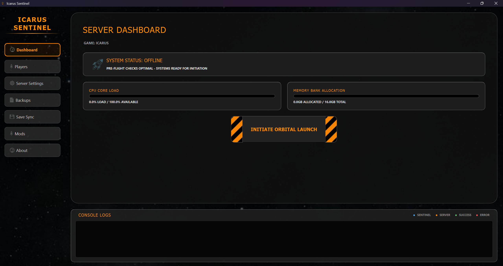
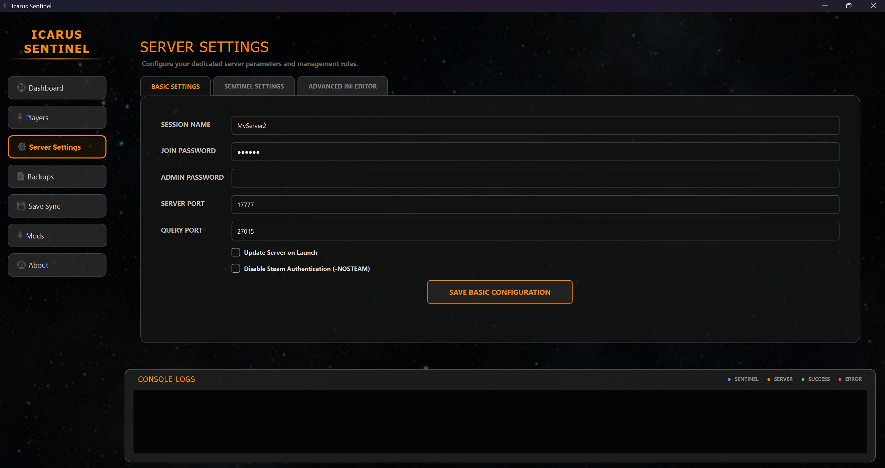

# Icarus Sentinel - User Guide

## What is Icarus Sentinel?
**Icarus Sentinel** is a lightweight desktop application designed to simplify the deployment and maintenance of a dedicated Icarus server. By offloading game logic to a dedicated process, it improves FPS and stability for players while automating essential tasks like updates, backups, and save-game security.

---

## Quick Start Guide

### Prerequisites
*   Windows 10 or 11 (64-bit).
*   A stable internet connection for downloading server files.
*   Recommended: At least 16GB of system RAM.

### Installation & Launch
1.  **Extract:** Unzip the `IcarusSentinel.zip` archive into a dedicated folder on your computer.
2.  **Launch:** Double-click `IcarusSentinel.exe` to open the manager.

### First Run Setup
1.  **SteamCMD:** The manager will check for `steamcmd.exe`. If missing, it will automatically download it for you.
2.  **Install Server:** Select an installation directory and click **"Install/Update Server"**. This will download over 15GB of Icarus Dedicated Server files.
3.  **Configure:** Head to the **"Configuration"** tab to set your server name, password, and admin ID.
4.  **Start:** Once the download is complete, click **"Start Server"**.

---

## Key Features & Workflows

### 1. Safe & Smart Launch
Sentinel checks your system RAM before launching and can automatically check for game updates every time you start the server, ensuring you're always on the latest version.

### 2. Automated Backups
Protect your progress with automated, timestamped ZIP backups of your world saves every 30 minutes and whenever the server shuts down. You can configure how many backups to keep to save disk space.

### 3. Save Synchronization
Sentinel can automatically sync your local single-player world saves to the dedicated server when it starts, and sync them back to your local machine when it stops. This allows you to jump between solo and dedicated play seamlessly.

### 4. Player & Resource Monitoring
Track connected players and server performance (CPU/RAM) in real-time. Sentinel also features built-in Windows notifications for player joins, server starts, and critical errors.

---

## Visual Previews

### Dashboard

### Configuration

---

## Troubleshooting
*   **Permissions:** If the server fails to start, try running `IcarusSentinel.exe` as an Administrator.
*   **Port Forwarding:** Ensure ports `17777` (UDP) and `27015` (UDP) are forwarded in your router settings to allow others to join.
*   **SteamCMD Errors:** If a download gets stuck, restart the application and click "Install/Update Server" again to resume.

---

## License
Distributed under the MIT License. See the `LICENSE` file for more information.

---
*Thank you for using Icarus Sentinel! Happy hunting, Prospectors.*
